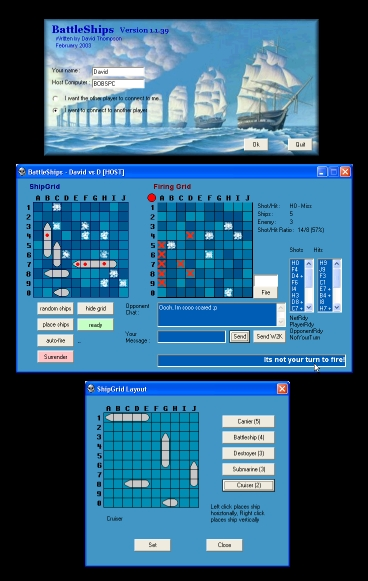



## BattleShips

### Description

BattleShips is a game with 2 human opponents playing over the network. It uses UDP (ports 4100 and 4101) protocol. One player acts as SERVER/HOST and the other as the CLIENT. Players choose their where they want to position their ships or the program can do it automatically. When players are ready they click the ready button. Whoever clicks ready first, gets to shoot first. Stats include where you have fired and where your opponent has fired, what your shot/hit ratio is, and how many ships are still in the game.
 
### More Info
 
Needs WINSOCK.OCX

             |
---                |---
**Submitted On**   |2004-02-25 15:28:52
**By**             |[David C\. Thompson](https://github.com/Planet-Source-Code/PSCIndex/blob/master/ByAuthor/david-c-thompson.md)
**Level**          |Intermediate
**User Rating**    |4.7 (33 globes from 7 users)
**Compatibility**  |VB 6\.0
**Category**       |[Games](https://github.com/Planet-Source-Code/PSCIndex/blob/master/ByCategory/games__1-38.md)
**World**          |[Visual Basic](https://github.com/Planet-Source-Code/PSCIndex/blob/master/ByWorld/visual-basic.md)
**Archive File**   |[BattleShip1713232252004\.zip](https://github.com/Planet-Source-Code/david-c-thompson-battleships__1-51988/archive/master.zip)

